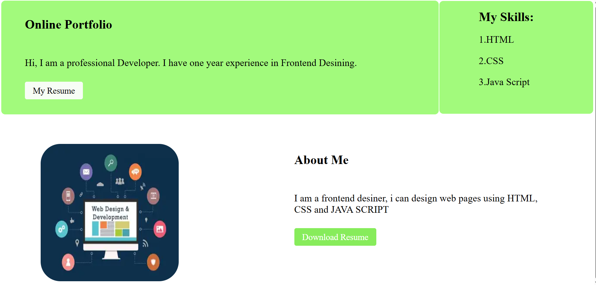
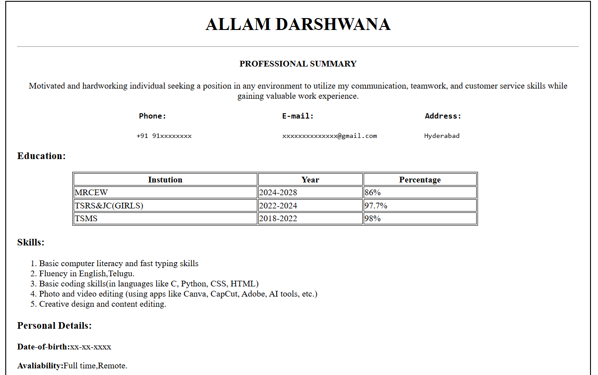
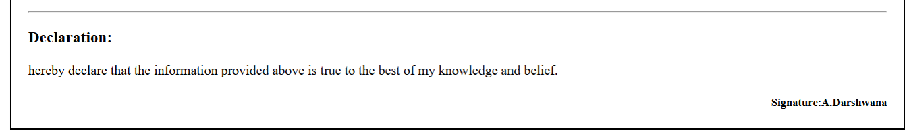
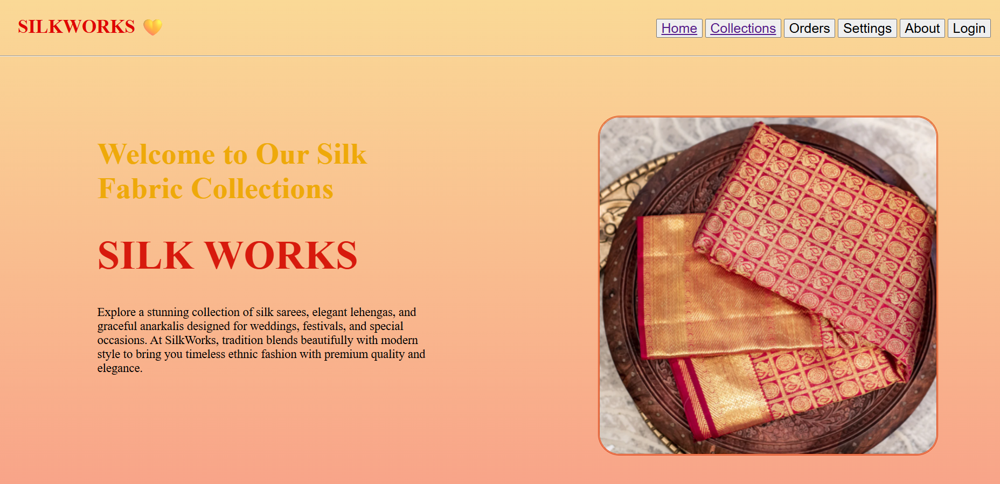
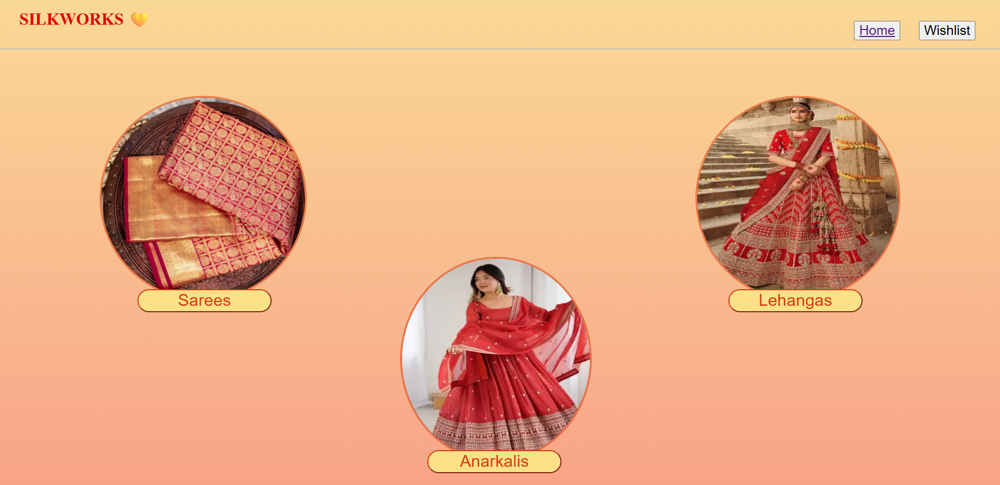

# TechnoHacks_Web-Design-Development
# Portfolio Website

A personal portfolio website built using HTML and CSS

## Features
- Responsive design
- About me and skills section
- My resume button and Download button
- Smooth scrolling

## Technologies Used
- HTML
- CSS

## How to Run
1. Download the project
2. Open `frontpage.html` in browser

## Author
Darshwana

## Screenshot of Website

## Screenshot of my Resume

# Product Landing Page

A Landing Page for Silkfabric Products website built using HTML and CSS

## Features
- Responsive design
- Home and Collections section
- Varied buttons
- Smooth scrolling

## Technologies Used
- HTML
- CSS

## How to Run
1. Download the project
2. Open `index.html` in browser

## Author
Darshwana

## Screenshot of Website main page

## Screenshot of Collections page

